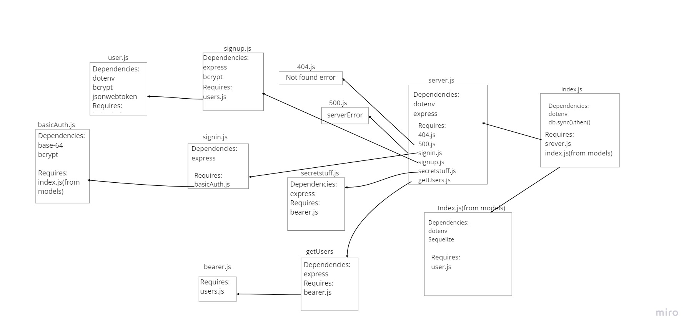

# bearer-auth
doing Authentication
UML Diagram:

# test passed :

# heroku link:

[heroku](https://shams-bearer-auth.herokuapp.com/)

# Action :
[Action](https://github.com/shamssar/bearer-auth/actions)
# Pull request:

[Pull request](https://github.com/shamssar/bearer-auth/pull/1)